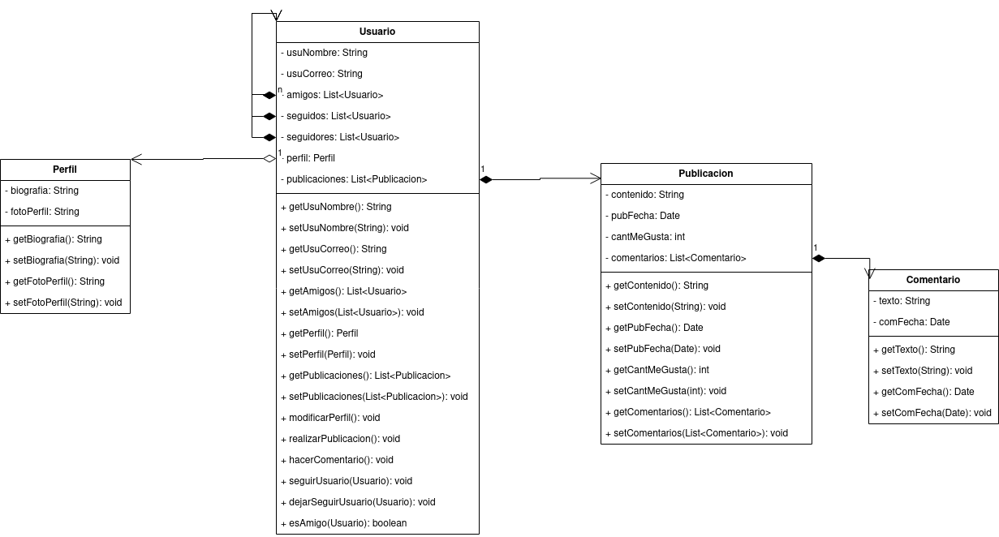

# Red Social

## Índice
- [Descripción](#index1)
- [Diagrama](#index2)
- [Pseudocódigo](#index3)

## Descripción 

Diseñe un diagrama de clases para un sistema de red social. El sistema debe permitir a los usuarios crear perfiles, publicar contenido, seguir a otros usuarios y dar "me gusta" a las publicaciones. Teniendo en cuenta la siguiente información:

- Representa a los usuarios del sistema, con los siguientes atributos: nombre de usuario, correo electrónico y lista de amigos (Otros usuarios).
- Representa las publicaciones realizadas por los usuarios, con atributos como contenido, fecha de publicación y cantidad de "me gusta". Ten en cuenta que un usuario realizará publicaciones.
- Cada usuario debe de poseer un perfil, que contiene información adicional sobre cada usuario, como la biografía y la foto de perfil.
- Se debe de gestionar la creación de perfiles de usuario, la publicación de contenido y las interacciones entre usuarios.
- Representa los comentarios realizados por los usuarios en las publicaciones, con atributos como texto y fecha. Ten en cuenta que un usuario podrá realizar comentarios sobre las publicaciones.
- Se debe de tener en cuenta los seguidores entre usuarios. Es decir, dos usuarios serán amigos si uno u otro se sigue.

#

