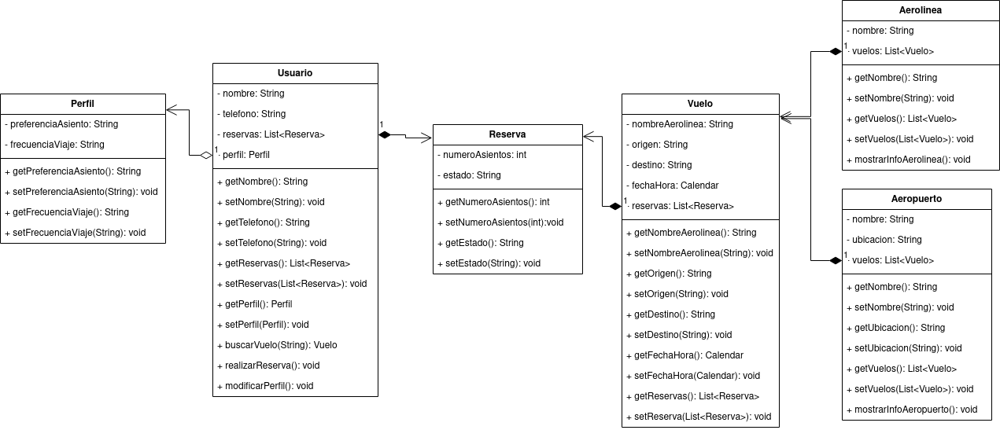

<div align="justify">

# Sistema de Reservas de Vuelos

## Índice
- [Descripción](#index1)
- [Diagrama](#index2)
- [Pseudocódigo](#index3)

## Descripción <a name="index1"></a>

Diseñe un diagrama de clases para un sistema de reservas de vuelos. El sistema debe permitir a los usuarios buscar vuelos, realizar reservas, gestionar perfiles y visualizar información sobre aerolíneas y aeropuertos. Ten en cuenta la siguiente información:

- Representa a los usuarios del sistema, con atributos como nombre, número de teléfono y lista de reservas.
- Representa los vuelos disponibles, con atributos como aerolínea, origen, destino, fecha y hora.
- Almacena la información de las reservas realizadas por los usuarios, con detalles como el número de asientos reservados y el estado de la reserva.
- Representa las aerolíneas que operan en el sistema, con atributos como nombre y lista de vuelos.
- Representa la información de los aeropuertos, como nombre, ubicación y lista de vuelos asociados.
- Almacena información adicional sobre los usuarios, como preferencias de asientos y frecuencia de viaje, siendo este su perfil.

## Diagrama <a name="index2"></a>



## Pseudocódigo <a name="index3"></a>

Clase Usuario
```code
Propiedades:
    private String Nombre
    private String telefono
    private List<Reserva> reservas
    private Perfil perfil
Métodos:
    getters y setters
    
```

Clase Perfil
```code
Propiedades:
    private String preferenciaAsiento
    private String frecuenciaViaje
Métodos:
    getters y setters
    
```

Clase Reserva
```code
Propiedades:
    private int numeroAsientos
    private String estado
Métodos:
    getters y setters
    
```

Clase Vuelo
```code
Propiedades:
    private String nombreAerolinea
    private String origen
    private String destino
    private Calendar fechaHora
    private List<Reserva> reservas
Métodos:
    getters y setters
    
```

Clase Aerolinea
```code
Propiedades:
    private String nombre
    private List<Vuelo> vuelos
Métodos:
    getters y setters
    
```

Clase Aeropuerto
```code
Propiedades:
    private String nombre
    private String ubicacion
    private List<Vuelo> vuelos
Métodos:
    getters y setters
    
```

</div>